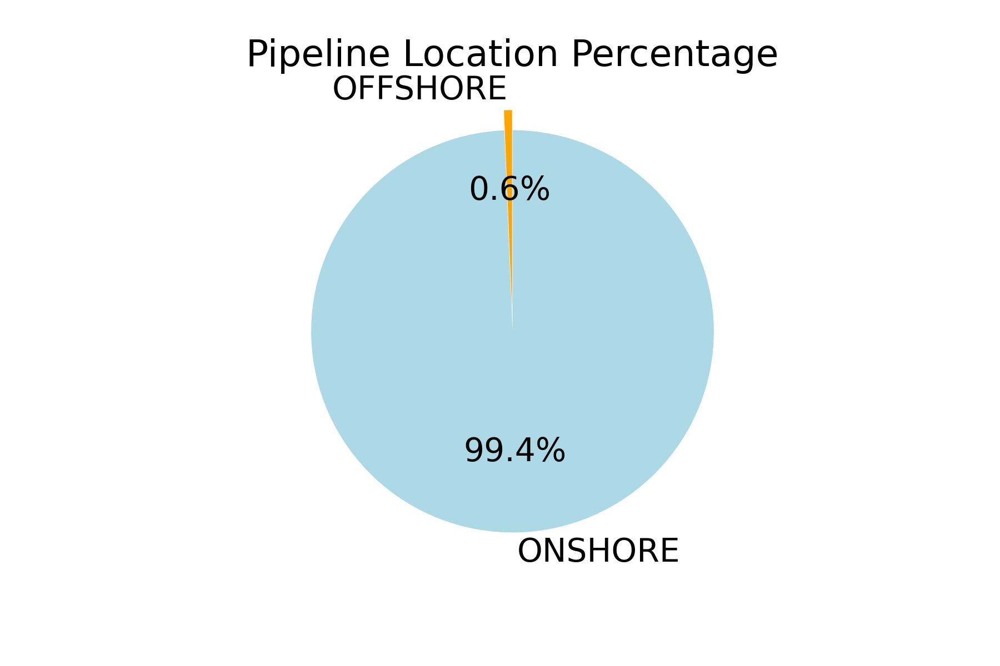
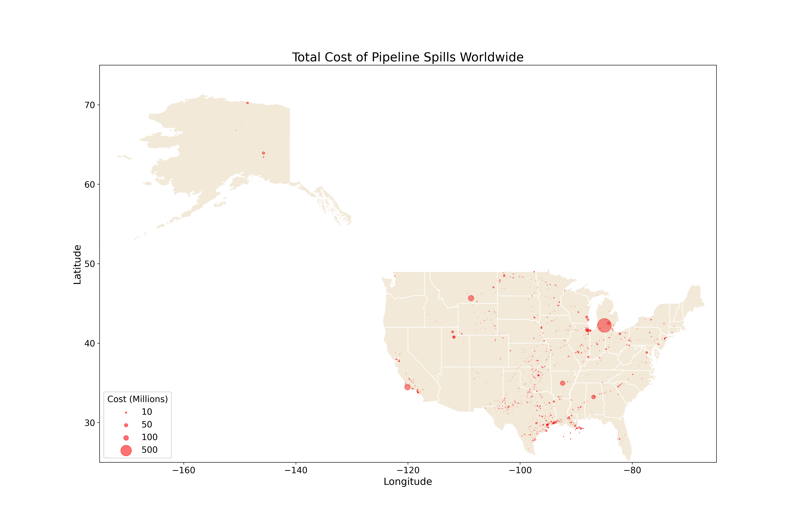
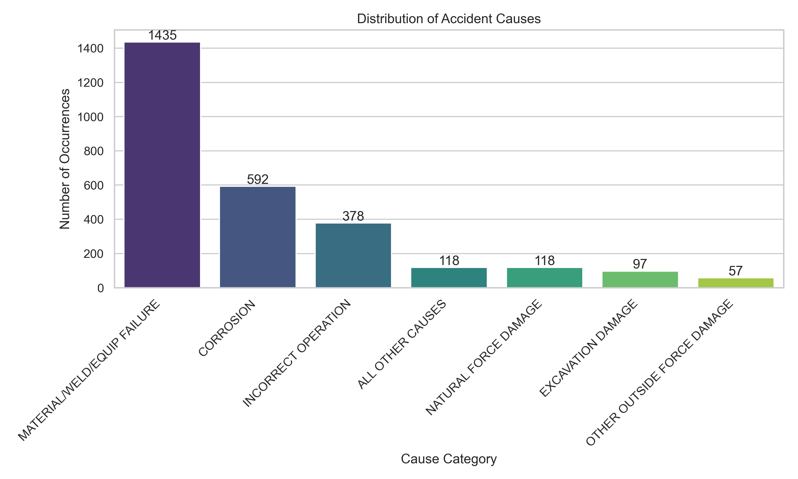
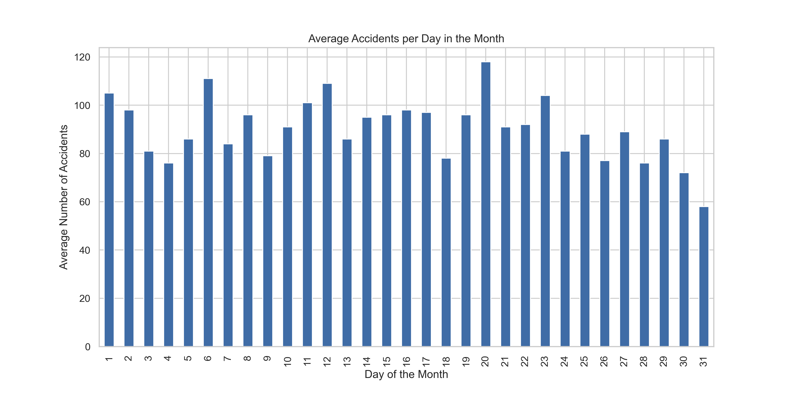

# **Oil pipeline accidents analysis**

Visualisation of oil pipeline accident

**PLEASE SEE 'oil_pipeline_accidents_visualization.ipynb' for the JupyerNotebook** 

The objective of this analysis is to examine a dataset containing records of oil pipeline leaks and spills reported to the Pipeline and Hazardous Materials Safety Administration since 2010. The dataset provides valuable information about each incident, including the date and time of the accident, the operator and pipeline involved, the cause of the incident, the type of hazardous liquid released, the quantity lost, injuries and fatalities, and associated costs.

By analyzing this dataset, we aim to gain insights into the patterns, trends, and factors contributing to oil pipeline accidents. This information can be crucial for understanding the safety and environmental implications of pipeline operations, as well as identifying areas for improvement in preventing and mitigating such incidents.

The dataset was collected and published by the Department of Transportation's Pipeline and Hazardous Materials Safety Administration, ensuring the reliability and authenticity of the reported information. With this dataset as our foundation, we will explore various aspects of the pipeline accidents, investigate their causes, assess the extent of damage and costs incurred, and examine any other relevant factors that may shed light on the overall impact of these incidents.

By conducting this analysis, we aim to provide valuable insights that can inform policymakers, pipeline operators, and other stakeholders involved in ensuring the safety and sustainability of oil pipeline infrastructure.


Table of Contents

1. Data Loading and Exploration
2. Data Visualization
    - Accident Locations
    - Most Affected Companies
    - Cost Analysis
    - Volume of Liquid Lost
    - Accident Causes
    - Time-based Patterns


## 1. Data Loading and Exploration

### Pipeline Accidents Dataset

The Pipeline Accidents dataset contains information about pipeline accidents that have occurred in the United States. The dataset provides details on various aspects of the accidents, including the accident date and time, operator information, location, cause of the accident, injuries and fatalities, property damage costs, and other related information. Dataset Overview

```
Number of rows: 2795
Number of columns: 48
```

### Key Features

Some of the key features of the dataset include:

- Report Number: A unique identifier for each accident report.
- Accident Year: The year in which the accident occurred.
- Accident Date/Time: The date and time of the accident.
- Operator Name: The name of the pipeline operator involved in the accident.
- Pipeline/Facility Name: The name of the pipeline or facility associated with the accident.
- Pipeline Location: Indicates whether the pipeline is located onshore or offshore.
- Pipeline Type: The type of pipeline (e.g., aboveground, underground).
- Liquid Type: The type of liquid involved in the accident (e.g., crude oil, flammable/toxic fluid).
- Accident City, County, and State: The location of the accident (city, county, and state).
- Accident Latitude and Longitude: The geographical coordinates of the accident location.
- Cause Category and Subcategory: The categorization of the cause of the accident.
- Injuries and Fatalities: Information on injuries and fatalities associated with the accident.
- Property Damage Costs: The costs of property damage resulting from the accident.
- Other Costs: Other costs incurred due to the accident.
- All Costs: The total costs associated with the accident.

### Missing Values

The dataset contains missing values in some columns, such as Pipeline/Facility Name, Pipeline Type, Liquid Subtype, and others. The number of missing values varies across columns. Summary Statistics

The summary statistics provide a statistical overview of numeric columns in the dataset, including measures such as count, mean, standard deviation, minimum, maximum, and quartiles for relevant features.

## 2. Data Visualization

### Where are the accident?

To begin with, the dataset includes a location column that denotes whether the accident occurred offshore or onshore.

Due to less than 1% of the data focusing on offshore accidents, this dataset is not suitable for conducting a meaningful comparison between offshore and onshore accidents.


Let's looks where are located the accident:

The majority of accidents in the dataset are concentrated in the United States. Consequently, for the remaining analysis, particular emphasis will be placed on the US, particularly when visualizations involve maps.

### Which companies are the most affected?
Let's examine which companies have been most impacted by accidents since 2010, as represented in this dataset.


### What about the cost?
Analyzing the cost data in this dataset provides valuable insights into the financial impact of pipeline spills. It helps quantify the economic consequences, assess risks, allocate resources effectively, ensure regulatory compliance, and drive industry improvement.




### What about the lost in barrel ?
Analyzing the barrel loss data in this dataset provides crucial insights into the volume of product lost during pipeline spills. It helps evaluate the environmental impact, assess safety risks, implement preventive measures, optimize response strategies, and enhance overall pipeline integrity. Understanding the magnitude of barrel loss enables stakeholders to make informed decisions and take appropriate actions to minimize future losses and protect natural resources.


### What are the most predominant causes for these accidents?


The most predominant reason for the accident includes equipment failure.


### Is there a period in the day, month or year that accident are more likely to happend ?




The analysis of the accident data suggests that, on average, the number of accidents remains relatively consistent throughout the year and across different months. However, when considering the daily scale, there is an observable trend indicating a higher number of accidents between 6 AM and 6 PM. This pattern may be attributed to various factors, such as increased human activity, rush hour traffic, or working hours when operational activities are at their peak.
To gain further insights into the causes of accidents and their relationship with the time of day, mapping the accident causes alongside the corresponding time periods could provide valuable information. By visually representing the spatial distribution of accident causes and their occurrence during different times of the day, patterns and correlations may emerge, shedding light on potential factors contributing to accidents during specific time periods. Such analysis can help identify hotspots, time-sensitive risk factors, and inform targeted preventive measures and safety strategies.